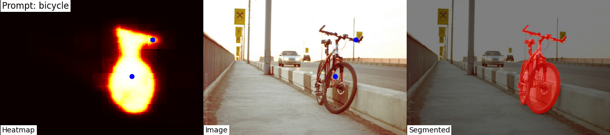
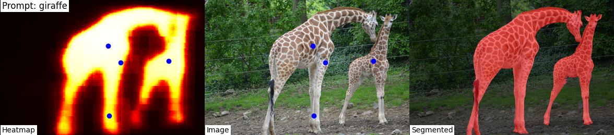
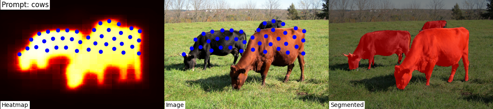
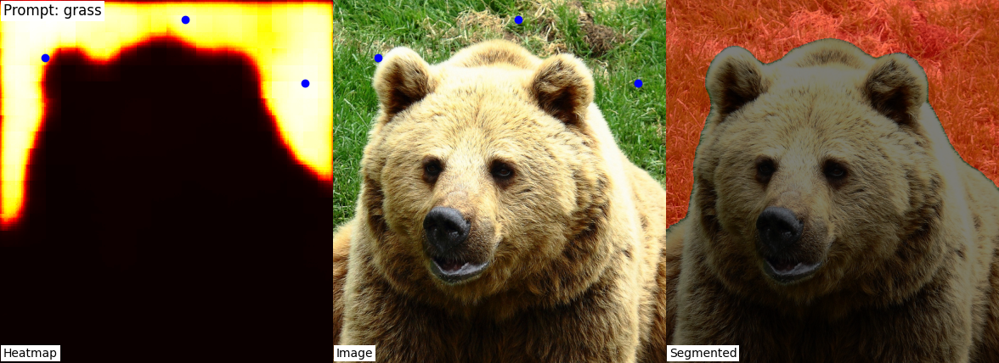
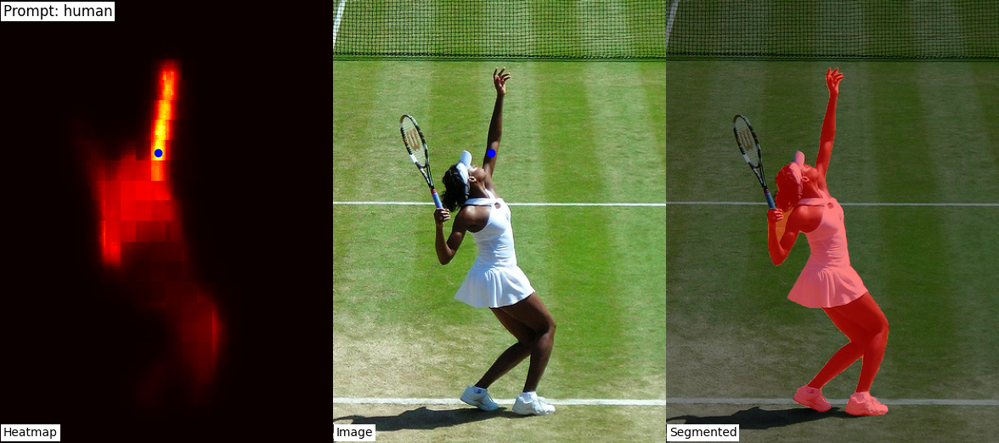
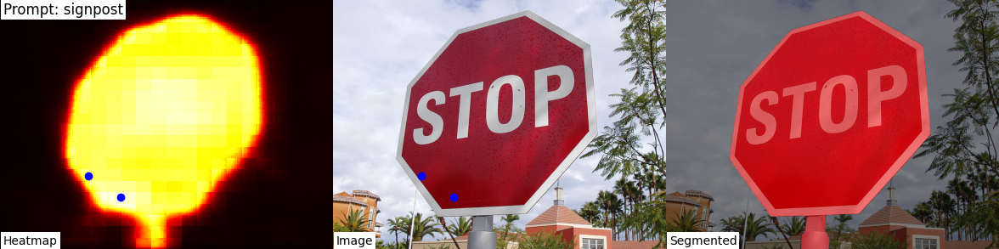
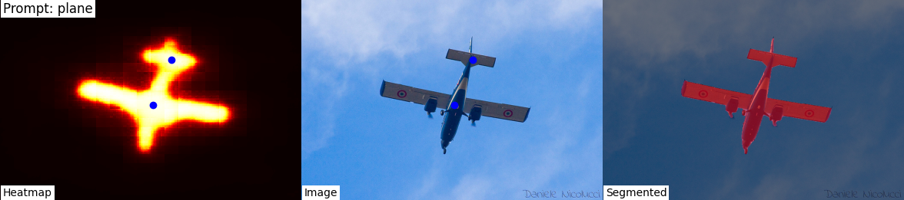
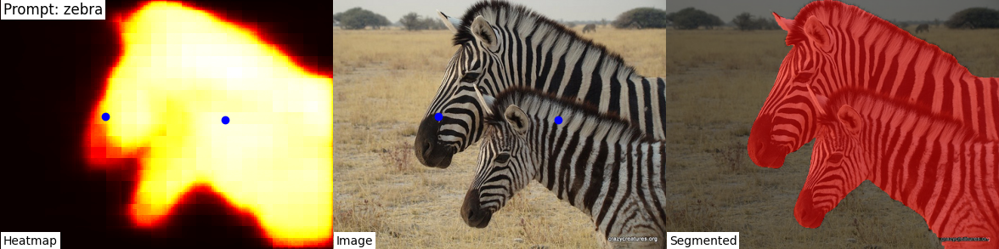
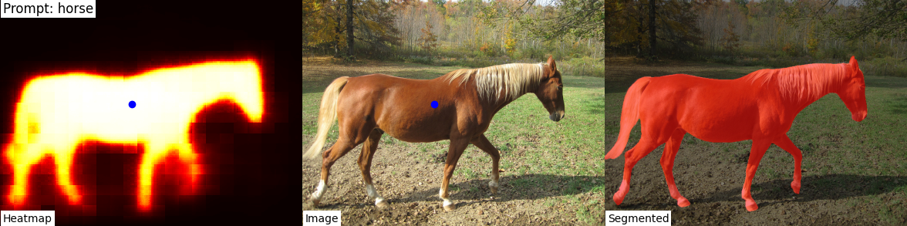

# CLIP-SAM2 Semantic Segmentation

## Introduction

CLIP-SAM2 is a semantic segmentation tool designed to enhance image segmentation tasks with the power of multimodal understanding through **CLIP** and **Segment Anything Model (SAM)**. Our motivation stems from the need for an intuitive, prompt-based segmentation solution that allows users to interactively specify their regions of interest in an image. By combining the **natural language understanding of CLIP** and the **powerful mask generation of SAM**, users can easily generate segmentation maps with multiple classes or even single objects.

The main advantages of using this repository include:
- **Easy segmentation with natural language prompts**: No need for predefined classes—just describe what you want to segment (e.g., "tree", "human", "bicycle").
- **Support for multi-class segmentation**: Input multiple prompts at once and generate masks for all specified classes.
- **Customizable point selection algorithms**:
  - **Gradient-based selection**: Selects points based on regions with low gradients to focus on significant regions.
  - **Shuffle-based point selection**: Introduces randomness in point selection for cases where spread or gradient information is not as critical.

### Key Features:
- **Multi-class segmentation**: Generate masks for multiple prompts at once, allowing fine-grained image segmentation.
- **Customizable output**: Retrieve segmentation masks, visual overlays, and heatmaps for your chosen prompts.

## Results

Below are some examples of the outputs generated by CLIP-SAM2. Each result includes the original image, the heatmap from CLIP, and the corresponding segmentation mask:

<p align="center">
  
  
</p>

<p align="center">
  
  
</p>

<p align="center">
  
  
</p>

<p align="center">
  
  
</p>

<p align="center">
  
  
</p>

Each result shows the:
- **Original image**
- **Heatmap generated by CLIP** based on the user-specified prompt(s)
- **Mask** created by SAM based on the selected points

## How to Use

### Prerequisites

Ensure you have Docker installed on your system. You'll also need the files `infer.py` and `colors.txt`, along with the `requirements.txt` file, to run the script locally or in a Docker container.

### Running with Docker

We provide a Dockerfile for ease of use. To set up your environment, follow these steps:

1. **Build the Docker image**:
   ```bash
   docker build -t clipsam2-segmentation .
   ```

2. **Run the container**:
   You can run a single image segmentation task by running the following command:
   ```bash
   docker run --rm -v /path/to/input:/workspace/input -v /path/to/output:/workspace/output clipsam2-segmentation python infer.py --image_path /workspace/input/image.jpg --save_dir /workspace/output --prompts "tree, car, road"
   ```
   - Replace `/path/to/input` with your actual image directory and `/path/to/output` with your output directory.

3. **Batch processing an entire directory**:
   You can process an entire directory of images using the provided `process_dir.sh` script:
   ```bash
   docker run --rm -v /path/to/input:/workspace/input -v /path/to/output:/workspace/output clipsam2-segmentation bash process_dir.sh /workspace/input /workspace/output
   ```

### Running Locally

If you'd like to run this script locally, you'll need to set up a Python environment with the required dependencies.

1. **Install dependencies**:
   ```bash
   pip install -r requirements.txt
   ```

2. **Run inference**:
   You can run the inference script locally on a single image by running:
   ```bash
   python infer.py --image_path /path/to/your/image.jpg --save_dir /path/to/output --prompts "bear, tree, car"
   ```
   You can provide **multiple prompts** separated by commas to get masks for different classes.

### Example Usage

The script supports both **single-class** and **multi-class** segmentation. You can specify a single object or multiple objects in your `--prompts` argument, and the tool will generate a mask for each object.

For example:
```bash
python infer.py --image_path /path/to/your/image.jpg --save_dir /path/to/output --prompts "bear, tree, car"
```

This command will generate masks for the bear, tree, and car in the image.

### Batch Processing

To process a whole directory of images at once, you can use the `process_dir.sh` script. Here's how you can do it locally:

```bash
bash process_dir.sh /path/to/input_directory /path/to/output_directory
```

This script will iterate through all images in the input directory, run the segmentation for each, and save the results in the output directory.

This project is built upon amazing open-source projects:


- **CLIPSeg**: For heatmap generation, based on CLIP. You can find their work at [https://github.com/timojl/clipseg](https://github.com/timojl/clipseg).

- **SAM2**: For the unsupervised instance segmentation model used for generating the masks. [https://github.com/facebookresearch/sam2](https://github.com/facebookresearch/sam2).
